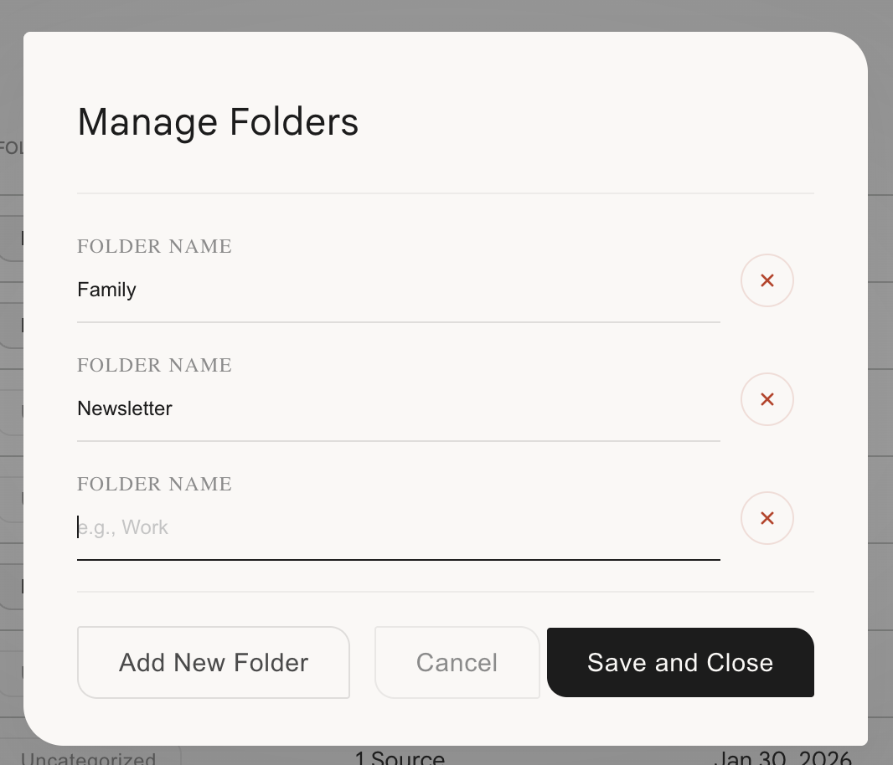
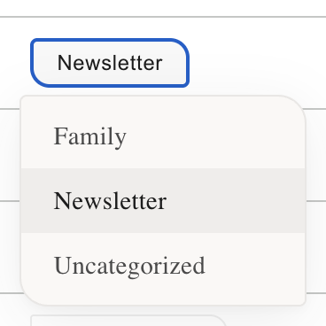
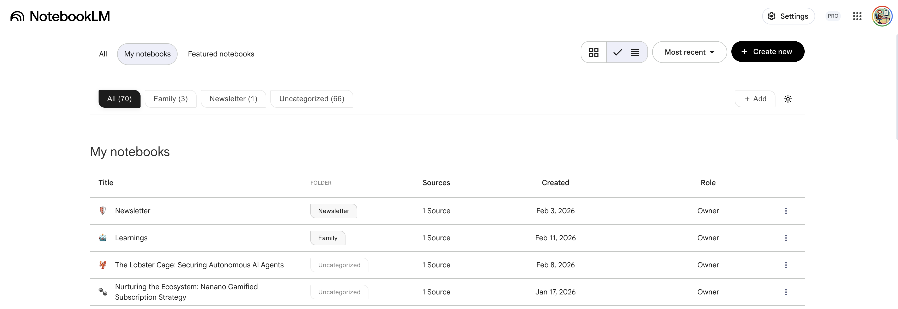

# NotebookLM Folder Manager

A Chrome extension that adds **folder-based organization** to [NotebookLM](https://notebooklm.google.com/). Create folders, assign notebooks, and filter your list instantly.

---

## Preview

---

## Features

- Folder column in the notebook table view
- Filter bar with folder tabs and notebook counts
- Quick "Add" button to create folders without opening the manager
- Folder assignment via clickable tag on each notebook
- Remembers your last selected filter across sessions
- Sumi-e inspired minimal design

---

## Installation

1. **Download or clone this repository**
2. Open Chrome and go to `chrome://extensions/`
3. Enable **Developer mode** (top-right toggle)
4. Click **Load unpacked** and select the `extensions/chrome/` folder
5. Visit [NotebookLM](https://notebooklm.google.com/) and the folder UI appears automatically

---

## Usage

### Managing Folders

Click the **gear icon** in the filter bar to open the folder manager. Add, rename, or delete folders, then hit **Save and Close**.

### Assigning Notebooks

Click the folder tag on any notebook row to open a dropdown and pick a folder. The tag updates immediately.

### Filtering

Click any folder tab in the filter bar to show only notebooks in that folder. Click **All** to reset.

---

## FAQ

**Q: I don't see the folder UI after installing?**

Make sure you are on [notebooklm.google.com](https://notebooklm.google.com/), the extension is enabled in `chrome://extensions/`, and the page has finished loading.

**Q: Can I use this on Firefox?**

Not currently. This version targets Chrome only.

---

## Support

If you find this useful, consider buying me a coffee:

---

## License

[PolyForm Noncommercial 1.0.0](LICENSE)
